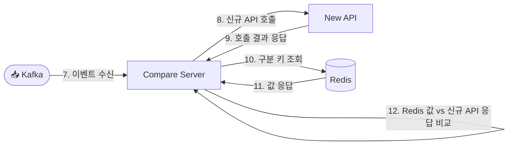

# 🔍 ShadowDiff Compare Server

> **역할:** 프록시가 발행한 섀도잉 이벤트를 소비하여 **신규 API를 재현 호출하고, 레거시 응답과의 정합성을 검증하는 컨슈머 애플리케이션**

> **기술 스택:** Java 21 (Virtual Threads) · Spring Boot 3.3 · Spring Kafka · Spring Data Redis · Micrometer

전체 아키텍처와 데이터 규격의 단일 기준(Source of Truth)은 **ShadowDiff Proxy 리포지토리의 README**입니다. 이 문서는 그중 **시퀀스 7번 이후 구간**만 다룹니다.

---

## 1. 담당 범위 (Scope)

전체 시퀀스에서 이 프로젝트가 책임지는 구간은 다음과 같습니다.

| 구간 | 단계 | 담당 |
| :--- | :--- | :--- |
| 1 ~ 6 | 클라이언트 요청 → 레거시 Bypass → Redis 적재 → Kafka 발행 → 클라이언트 응답 | **Proxy** (별도 프로젝트) |
| **7 ~ 11** | **Kafka 이벤트 수신 → 신규 API 호출 → Redis 조회 → 정합성 비교** | **Compare Server (이 프로젝트)** |



### 이 프로젝트가 하지 않는 것

* 클라이언트 트래픽을 직접 수신하지 않는다. (HTTP 서버는 Actuator 노출 용도)
* 레거시 API를 호출하지 않는다. 레거시 응답은 **Redis에 적재된 스냅샷만** 사용한다.
* 검증 실패가 원본 트래픽에 어떤 영향도 주어서는 안 된다. 이 프로젝트는 **완전한 부가 경로**다.

---

## 2. 처리 흐름 (Verification Pipeline)

```
Kafka 이벤트 수신
   ↓
Redis에서 레거시 응답 조회 ──(미스)──▶ 짧은 재시도 ──(계속 미스)──▶ SKIPPED
   ↓
신규 API 재현 호출 (1:N 병렬)
   ↓
Diff 엔진 비교 (EXACT / TYPE_CAST / IGNORE_FIELD / STRUCT_MAPPING)
   ↓
결과 기록 (MATCH / MISMATCH / SKIPPED / FAILED)
```

### Redis 미스 처리

프록시의 Redis 적재는 클라이언트 응답 이후 비동기로 이뤄지므로, **Kafka 이벤트가 Redis 적재보다 먼저 도착할 수 있습니다.** 이를 흡수하기 위해 `shadowdiff.redis.retry-delay` 간격으로 `max-retry` 횟수만큼 재조회하고, 그래도 없으면 해당 이벤트를 `SKIPPED`로 기록하고 넘어갑니다.

### 실패 격리

검증은 부가 경로이므로 **개별 메시지 실패로 컨슈머가 정체되지 않는 것**을 우선합니다.

* 역직렬화 실패 → `ErrorHandlingDeserializer`가 흡수 (파티션 블로킹 방지)
* 처리 실패 → `DefaultErrorHandler`가 1초 간격 2회 재시도 후 로그 기록 및 다음 메시지 진행

---

## 3. 소비 데이터 규격 (Consumed Contract)

Proxy와 이 프로젝트는 **서로 의존하지 않고 각자 동일한 규격을 정의**합니다. 규격 클래스는 `shadowdiff.compare.contract` 패키지에 있으며, 변경 규칙은 해당 패키지의 `package-info.java`를 참고하세요.

### Kafka — `shadowdiff.request` (요청 정보)

```json
{
  "uuid": "9f1c3b7e-4a2d-4c8f-9b16-2f0c5d8e7a31",
  "request": {
    "method": "GET",
    "url": "/api/v1/user/profile",
    "query": { "userId": "10025" },
    "body": null
  }
}
```

### Redis — `shadowdiff:response:{uuid}` (레거시 응답)

```json
{
  "uuid": "9f1c3b7e-4a2d-4c8f-9b16-2f0c5d8e7a31",
  "response": {
    "statusCode": 200,
    "body": { "data": { "user_id": "10025" } }
  }
}
```

> 규격 변경 시 **Consumer(이 프로젝트)를 먼저 배포한 뒤 Producer를 배포**해야 합니다. 필드 추가는 양측 모두 `@JsonIgnoreProperties(ignoreUnknown = true)`를 사용하므로 안전합니다.

---

## 4. 패키지 구조

```
shadowdiff.compare
├── consumer/      ShadowRequestConsumer        수신 → 위임 (메시징 경계)
├── application/   VerificationService          검증 절차 오케스트레이션
├── domain/        VerificationOutcome          검증 결과 (sealed interface)
│                  FieldDifference              필드 단위 불일치 정보
├── port/          LegacyResponseRepository     저장소 경계 (기술 비의존)
├── adapter/redis/ RedisLegacyResponseRepository  Redis 구현체
├── contract/      Kafka·Redis 데이터 규격 (Producer와 각자 정의)
└── config/        KafkaConsumerConfig, ShadowDiffProperties
```

설계 원칙은 **의존 방향을 안쪽으로 고정**하는 것입니다. `consumer`와 `adapter`는 Kafka·Redis 기술을 알지만, `application`과 `domain`은 `port` 인터페이스만 알면 됩니다.

---

## 5. 설정 (`shadowdiff.*`)

| 키 | 기본값 | 설명 |
| :--- | :--- | :--- |
| `topic` | `shadowdiff.request` | 소비 대상 Kafka 토픽 |
| `redis.key-prefix` | `shadowdiff:response:` | 레거시 응답 키 프리픽스 |
| `redis.retry-delay` | `200ms` | Redis 미스 시 재조회 대기 시간 |
| `redis.max-retry` | `2` | Redis 미스 재시도 횟수 |
| `new-api.base-url` | `http://localhost:8081` | 신규 API 베이스 URL |
| `new-api.timeout` | `3s` | 신규 API 개별 호출 타임아웃 |
| `new-api.max-concurrency` | `50` | 1:N 호출 동시 실행 상한 (하류 시스템 보호) |

환경변수 오버라이드: `KAFKA_BOOTSTRAP_SERVERS`, `REDIS_HOST`, `REDIS_PORT`, `NEW_API_BASE_URL`

---

## 6. 실행

```bash
# 의존 인프라 (Kafka, Redis)가 기동된 상태여야 한다.
./gradlew bootRun
```

```bash
./gradlew build
```

* 요구 사항: **JDK 21**
* Actuator: `/actuator/health`, `/actuator/prometheus`

---

## 7. 구현 현황

| 구간 | 상태 |
| :--- | :--- |
| Kafka Consumer + 역직렬화/에러 핸들링 | ✅ |
| Redis 레거시 응답 조회 (재시도 포함) | ✅ |
| 검증 결과 도메인 모델 | ✅ |
| 신규 API 매핑 및 1:N 병렬 호출 | ⬜ TODO |
| Rule 기반 Diff 엔진 | ⬜ TODO |
| 결과 기록 (Micrometer 메트릭 + Mismatch 덤프) | ⬜ TODO |
| DLT(`shadowdiff.request.DLT`) 연동 | ⬜ TODO |

미구현 구간은 `VerificationService.verify()` 안에 단계별 TODO 주석으로 표시되어 있습니다.
